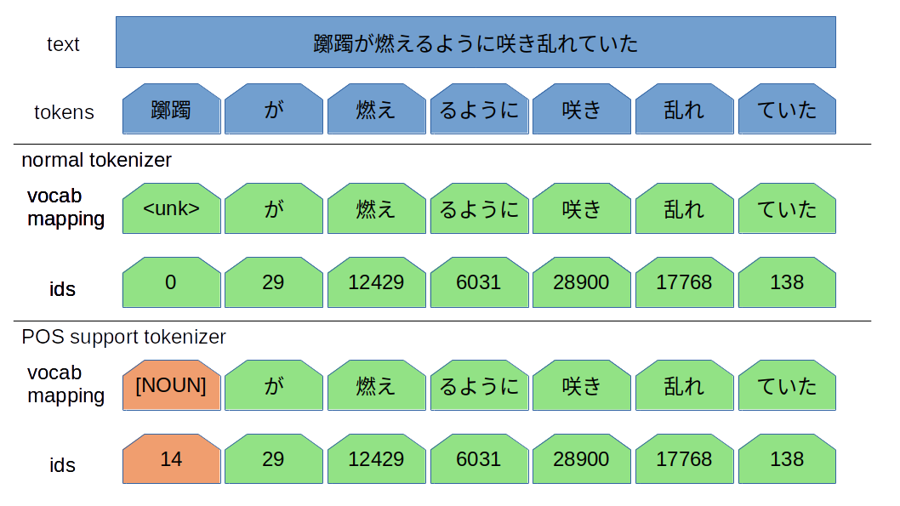

# my-pytorch-bert
These codes are [BERT](https://arxiv.org/abs/1810.04805) implementation by PyTorch.

The base of this implementation is [google BERT](https://github.com/google-research/bert) and [pytorch-pretrained-BERT](https://github.com/huggingface/pytorch-pretrained-BERT).
And we add [bert-japanese](https://github.com/yoheikikuta/bert-japanese) as [SentencePiece](https://github.com/google/sentencepiece) Tokenizer.<br/>

You can choose from several japanese tokenizers.

### How to convert from TensorFlow model to my model
```
python load_tf_bert.py \
    --config_path=multi_cased_L-12_H-768_A-12/bert_config.json \
    --tfmodel_path=multi_cased_L-12_H-768_A-12/model.ckpt-1400000 \
    --output_path=pretrain/multi_cased_L-12_H-768_A-12.pt
```

config json-file example:
```
{
	"vocab_size": 32000,
	"hidden_size": 768,
	"num_hidden_layers": 12,
	"num_attention_heads": 12,
	"intermediate_size": 3072,
	"attention_probs_dropout_prob": 0.1,
	"hidden_dropout_prob": 0.1,
	"max_position_embeddings": 512,
	"type_vocab_size": 2,
	"initializer_range": 0.02
}
```

### How to Classifier train
```
python run_classifier.py \
 --config_path=config/bert_base.json  \
 --train_dataset_path=/content/drive/My\ Drive/data/sample_train.tsv \
 --pretrain_path=/content/drive/My\ Drive/pretrain/bert.pt \
 --vocab_path=/content/drive/My\ Drive/data/sample.vocab \
 --sp_model_path=/content/drive/My\ Drive/data/sample.model \
 --save_dir=classifier/  \
 --batch_size=4  \
 --max_pos=512  \
 --lr=2e-5  \
 --warmup_steps=0.1  \
 --epoch=10  \
 --per_save_epoch=1 \
 --mode=train \
 --label_num=9
```

### How to Classifier evaluate
```
python run_classifier.py \
 --config_path=config/bert_base.json \
 --eval_dataset_path=/content/drive/My\ Drive/data/sample_eval.tsv \
 --model_path=/content/drive/My\ Drive/classifier/classifier.pt \
 --vocab_path=/content/drive/My\ Drive/data/sample.vocab \
 --sp_model_path=/content/drive/My\ Drive/data/sample.model \
 --max_pos=512 \
 --mode=eval \
 --label_num=9
```

### How to train Sentence Piece
```
python train-sentencepiece.py --config_path=json-file
```
json-file example:
```
{
    "text_dir" : "tests/",
    "prefix" : "tests/sample_text",
    "vocab_size" : 100,
    "ctl_symbols" : "[PAD],[CLS],[SEP],[MASK]"
}
```

### How to pre-train
```
python run_pretrain.py \
 --config_path=config/bert_base.json \
 --dataset_path=/content/drive/My\ Drive/data/sample.txt \
 --vocab_path=/content/drive/My\ Drive/data/sample.vocab \
 --sp_model_path=/content/drive/My\ Drive/data/sample.model \
 --save_dir=pretrain/ \
 --batch_size=4 \
 --max_pos=256 \
 --lr=5e-5 \
 --warmup_steps=0.1 \
 --epoch=20 \
 --per_save_epoch=4 \
 --mode=train
```

### Use FP16 (Pascal CUDA)
```
git clone https://github.com/NVIDIA/apex.git
cd apex
python setup.py install --cuda_ext --cpp_ext
```
and '--fp16' option attach.

Tested by Google Colaboratory GPU type only.

### Selection of Tokenizer to use 
```
python run_classifier.py \
 --config_path=config/bert_base.json  \
 --train_dataset_path=/content/drive/My\ Drive/data/sample_train.tsv \
 --pretrain_path=/content/drive/My\ Drive/pretrain/bert.pt \
 --vocab_path=/content/drive/My\ Drive/data/sample.vocab \
 --save_dir=classifier/  \
 --batch_size=4  \
 --max_pos=512  \
 --lr=2e-5  \
 --warmup_steps=0.1  \
 --epoch=10  \
 --per_save_epoch=1 \
 --mode=train \
 --label_num=9
 --tokenizer=mecab
```
'--tokenizer' becomes effective when '--sp_model_path' option is not attached.

tokenizer : mecab | juman | sp_pos | other-strings (google-bert basic tokenizer)

#### use MeCab
```
sudo apt install mecab
sudo apt install libmecab-dev
sudo apt install mecab-ipadic-utf8
git clone --depth 1 https://github.com/neologd/mecab-ipadic-neologd.git 
echo yes | mecab-ipadic-neologd/bin/install-mecab-ipadic-neologd -n 
pip install mecab-python3
```

#### use Juman++
```
wget https://github.com/ku-nlp/jumanpp/releases/download/v2.0.0-rc2/jumanpp-2.0.0-rc2.tar.xz
tar xfv jumanpp-2.0.0-rc2.tar.xz  
cd jumanpp-2.0.0-rc2
mkdir bld
cd bld
cmake .. -DCMAKE_BUILD_TYPE=Release -DCMAKE_INSTALL_PREFIX=/usr/local # where to install Juman++
make install -j4 
pip install pyknp
pip install mojimoji
```

#### use sp_pos (Sentence Piece with ginza)
```
pip install "https://github.com/megagonlabs/ginza/releases/download/latest/ginza-latest.tar.gz"
```



### LAMB Optimzer 

```
pip install pytorch_lamb
```
 and --optimizer='lamb' option attach.


### ALBERT mode
 --model_name=proj or --model_name=albert

### Pretrained model

[Pretrained ALBERT model and trained SentencePiece + Ginza/POS model (model_name=proj)](https://drive.google.com/drive/folders/1JnBPSvIJa_61QS0Sv0MZ_uQY2flVtlTJ) (wikipedia-ja 2019/10/03 corpus)

### Classification result of my-pytorch-bert
- Dataset : [livedoor ニュースコーパス](https://www.rondhuit.com/download.html)  6(training): 2(test) 2(dev not-use) 
- train epoch : 10

1. [Pretrained BERT model and trained SentencePiece model](https://drive.google.com/drive/folders/1Zsm9DD40lrUVu6iAnIuTH2ODIkh-WM-O?usp=sharing) (model converted).
```
              precision    recall  f1-score   support

           0       0.99      0.92      0.95       178
           1       0.95      0.97      0.96       172
           2       0.99      0.97      0.98       176
           3       0.95      0.92      0.93        95
           4       0.98      0.99      0.98       158
           5       0.92      0.98      0.95       174
           6       0.97      1.00      0.98       167
           7       0.98      0.99      0.99       190
           8       0.99      0.96      0.97       163

   micro avg       0.97      0.97      0.97      1473
   macro avg       0.97      0.97      0.97      1473
weighted avg       0.97      0.97      0.97      1473
```

2. [BERT日本語Pretrainedモデル](http://nlp.ist.i.kyoto-u.ac.jp/index.php?BERT%E6%97%A5%E6%9C%AC%E8%AA%9EPretrained%E3%83%A2%E3%83%87%E3%83%AB) (model converted).

```
              precision    recall  f1-score   support

           0       0.98      0.92      0.95       178
           1       0.92      0.94      0.93       172
           2       0.98      0.96      0.97       176
           3       0.93      0.83      0.88        95
           4       0.97      0.99      0.98       158
           5       0.91      0.97      0.94       174
           6       0.95      0.98      0.96       167
           7       0.97      0.99      0.98       190
           8       0.97      0.96      0.96       163

   micro avg       0.95      0.95      0.95      1473
   macro avg       0.95      0.95      0.95      1473
weighted avg       0.95      0.95      0.95      1473
```

3. Pretrained ALBERT model and trained SentencePiece + Ginza/POS model

```
             precision    recall  f1-score   support

           0       0.95      0.94      0.95       178
           1       0.96      0.95      0.96       172
           2       0.99      0.97      0.98       176
           3       0.88      0.89      0.89        95
           4       0.98      0.99      0.98       158
           5       0.94      0.98      0.96       174
           6       0.98      0.99      0.98       167
           7       0.98      0.99      0.98       190
           8       0.98      0.96      0.97       163

    accuracy                           0.97      1473
   macro avg       0.96      0.96      0.96      1473
weighted avg       0.97      0.97      0.97      1473

```


## Acknowledgments
This project incorporates code from the following repos:
* https://github.com/yoheikikuta/bert-japanese
* https://github.com/huggingface/pytorch-pretrained-BERT
* https://github.com/jessevig/bertviz

This project incorporates dict from the following repos:
* http://svn.sourceforge.jp/svnroot/slothlib/CSharp/Version1/SlothLib/NLP/Filter/StopWord/word/Japanese.txt
